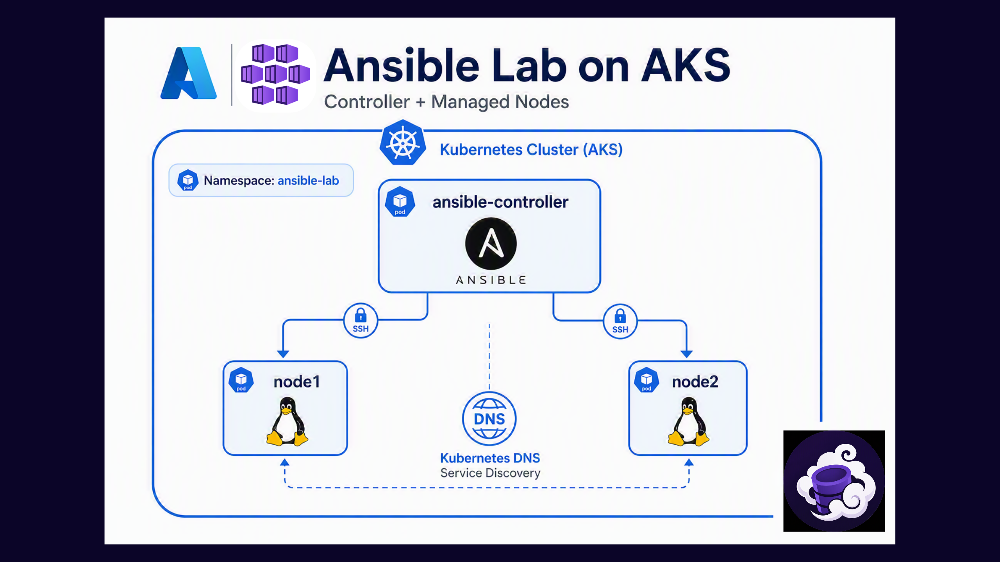

# AKS Lab Environment

This directory contains the Kubernetes manifests required to deploy a complete Ansible workshop lab environment on Azure Kubernetes Service (AKS).

The environment provides:

- 1 Ansible Controller
- 2 Managed Linux Nodes
- Internal Kubernetes DNS resolution
- SSH connectivity between controller and managed hosts
- A ready-to-use Ansible inventory

---

# Architecture



All components communicate using Kubernetes internal networking and DNS.

---

# Files

```text
aks-lab/
├── README.md
├── ns.yaml
├── controller.yaml
├── node1.yaml
├── node2.yaml
├── node1-service.yaml
└── node2-service.yaml
```

---

# Prerequisites

- Azure Kubernetes Service (AKS)
- kubectl configured
- Cluster administrator permissions

Verify connectivity:

```bash
kubectl cluster-info
```

---

# Deploy the Environment

Deploy all manifests:

```bash
kubectl apply -f aks-lab/
```

Expected output:

```text
namespace/ansible-lab created
deployment.apps/ansible-controller created
deployment.apps/node1 created
deployment.apps/node2 created
service/node1 created
service/node2 created
```

---

# Verify Deployment

Check all resources:

```bash
kubectl get all --namespace ansible-lab
```

Expected result:

```text
NAME                                      READY   STATUS
pod/ansible-controller-xxxxxxx            1/1     Running
pod/node1-xxxxxxx                         1/1     Running
pod/node2-xxxxxxx                         1/1     Running

NAME            TYPE        CLUSTER-IP
service/node1   ClusterIP   xxx.xxx.xxx.xxx
service/node2   ClusterIP   xxx.xxx.xxx.xxx

NAME                                 READY
deployment.apps/ansible-controller   1/1
deployment.apps/node1                1/1
deployment.apps/node2                1/1
```

---

# Access the Controller

Open a shell inside the controller:

```bash
kubectl exec -it \
  deployment/ansible-controller \
  -n ansible-lab \
  -- bash
```

Verify Ansible:

```bash
ansible --version
```

Example output:

```text
ansible [core 2.16.3]
```

---

# Validate Kubernetes DNS

From inside the controller:

```bash
getent hosts node1
```

Expected:

```text
10.x.x.x node1.ansible-lab.svc.cluster.local
```

Verify node2:

```bash
getent hosts node2
```

Expected:

```text
10.x.x.x node2.ansible-lab.svc.cluster.local
```

---

# Validate SSH Connectivity

From inside the controller:

```bash
ssh -o StrictHostKeyChecking=no student@node1
```

Password:

```text
redhat
```

Expected:

```text
Welcome to Ubuntu
```

Verify hostname:

```bash
hostname
```

Example:

```text
node1-xxxxxxxxx
```

Exit:

```bash
exit
```

Repeat for node2 if desired.

---

# Create an Inventory

Create a basic inventory file inside the controller:

```bash
cat > inventory.ini <<'EOF'
[linux]
node1
node2

[web]
node1

[database]
node2

[all:vars]
ansible_user=student
ansible_password=redhat
ansible_connection=ssh
EOF
```

Verify:

```bash
cat inventory.ini
```

---

# Validate Ansible Connectivity

Execute:

```bash
ansible all -i inventory.ini -m ping
```

Expected result:

```text
node1 | SUCCESS => {
    "changed": false,
    "ping": "pong"
}

node2 | SUCCESS => {
    "changed": false,
    "ping": "pong"
}
```

Successful output confirms:

- DNS resolution works
- SSH connectivity works
- Python is installed on the managed nodes
- Ansible can execute modules successfully

---

# Workshop Usage

## Ansible Core Exercises

This lab environment fully supports:

- Exercise 01 - Inventories and Playbooks
- Exercise 02 - Variables and Facts
- Exercise 03 - Conditionals, Loops and Handlers
- Exercise 04 - Templates
- Exercise 05 - Roles and Collections
- Exercise 06 - Ansible Navigator
- Exercise 07 - Debugging and Troubleshooting

The controller and managed nodes are sufficient for all Ansible Core exercises.

---

## AWX / Automation Controller Exercises

Exercises 08–12 require an AWX deployment.

The AKS lab environment provides the managed nodes that AWX will automate:

```text
AWX
 │
 ├── Inventory
 │
 ├── Credential
 │
 ├── Project
 │
 └── Job Templates
        │
        ▼

node1
node2
```

Before starting the AWX section, deploy AWX using:

```text
deployment/awx/
```

Once AWX is deployed:

- Exercise 08 - Controller Introduction
- Exercise 09 - Inventories and Credentials
- Exercise 10 - Projects and Job Templates
- Exercise 11 - Surveys and RBAC
- Exercise 12 - Workflows

can be performed against the nodes deployed by this AKS lab.

---

# Lab Credentials

Managed Nodes:

```text
Username: student
Password: redhat
```

Use only for workshop and lab environments.

---

# Troubleshooting

## Verify Pods

```bash
kubectl get pods -n ansible-lab
```

All pods should be:

```text
Running
```

---

## Verify Services

```bash
kubectl get svc -n ansible-lab
```

Expected:

```text
node1
node2
```

---

## Verify Endpoints

```bash
kubectl get endpoints -n ansible-lab
```

Expected:

```text
node1   <pod-ip>:22
node2   <pod-ip>:22
```

---

## Verify SSH

From the controller:

```bash
ssh student@node1
```

If host keys change after pod recreation:

```bash
ssh-keygen -R node1
ssh-keygen -R node2
```

Then reconnect:

```bash
ssh -o StrictHostKeyChecking=no student@node1
```

---

# Cleanup

Delete the environment:

```bash
kubectl delete namespace ansible-lab
```

This removes:

- Controller
- Managed Nodes
- Services
- Inventory targets

and fully cleans up the workshop environment.
